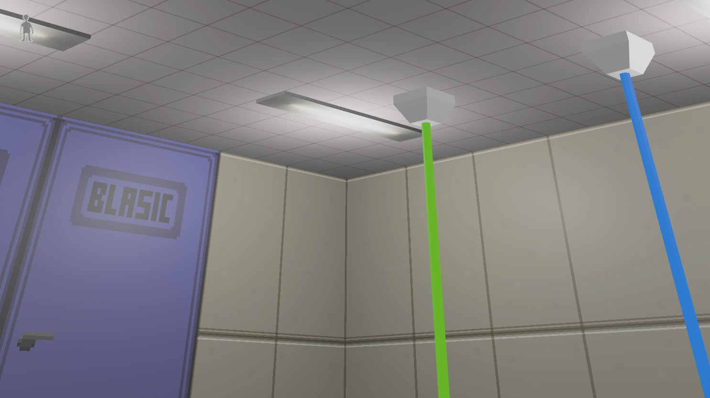
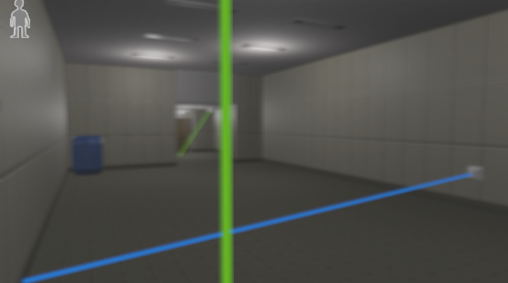

# Bevy Jam 3

You wake up in an unknown facility B.L.A.S.I.C, not remembering how you got here. You are forced to go through a series of tests of new laser treatment that is designed to enhance the vision abilities of humans. However, there are side effects… 

[Play it on itch.io](https://sorseg.itch.io/blasic)



Watch the screencast:

[](https://www.youtube.com/embed/c8RCd3yQ384)

## Controls
Use `WASD` to walk, mouse to look around, `Space` for jumping

## About the team
[Filipp Samoilov](https://github.com/samoylovfp): coding

[Natalia Samoilova](https://github.com/ladymarengo): coding, arts, concept 

[Svyatoslav Markov](https://github.com/SCHI85): textures

[Daniil Bubnov](https://github.com/demoth): 3D modeling, music, voice

[Julia Bubnova](https://github.com/denolia): music, voice


## Links
colliders from gltf mesh: https://discord.com/channels/691052431525675048/937158127491633152/1092888876940546059



## Exporting gltf from blender:

- File -> Export -> glTF 2.0 -> either gltf or glb. Include -> Data -> "Custom Properties" & "Punctual Lights"

## Building for web

```
trunk build --release --public-url . && sed -ri 's#/./#./#g' dist/index.html
```
